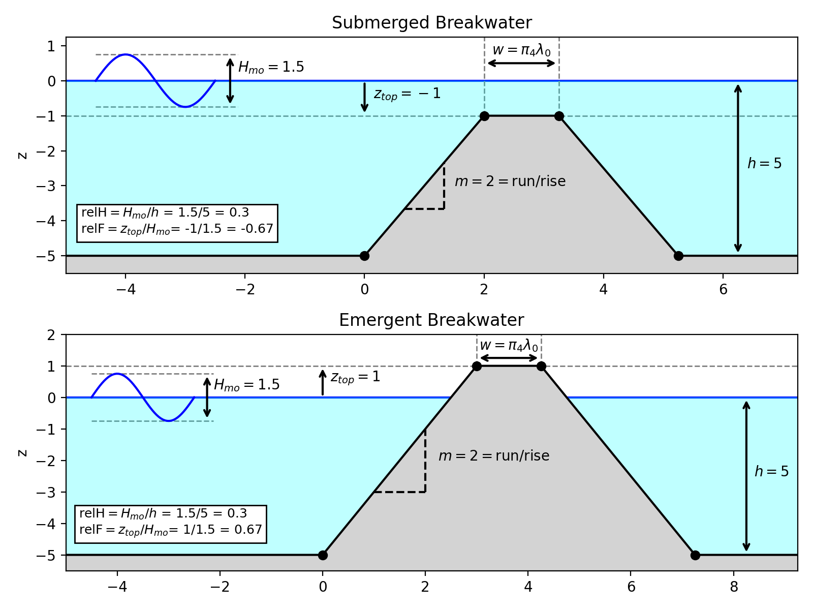
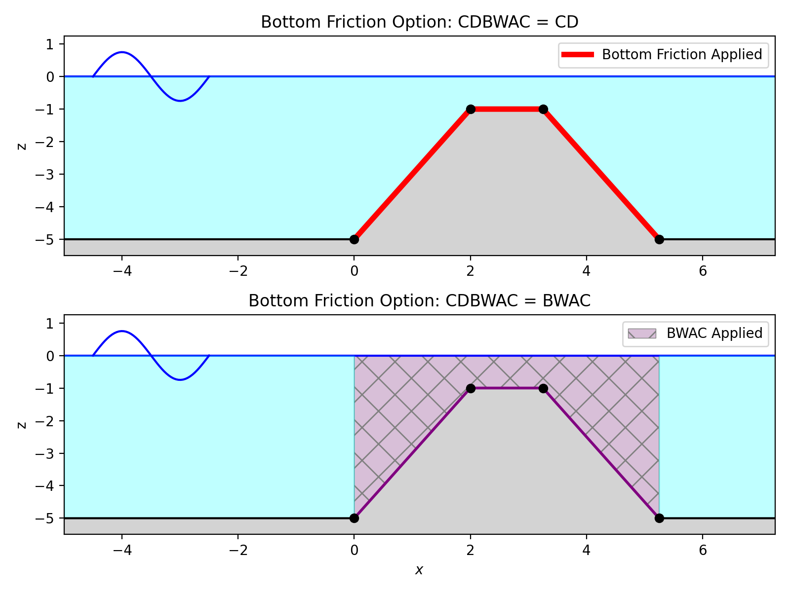
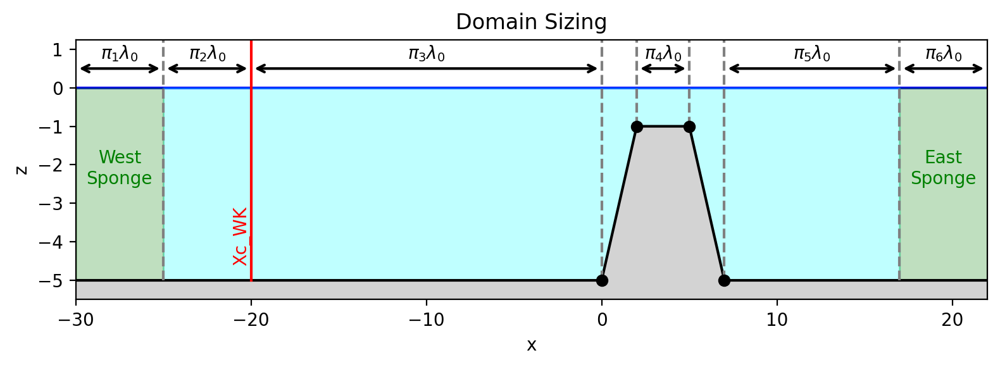
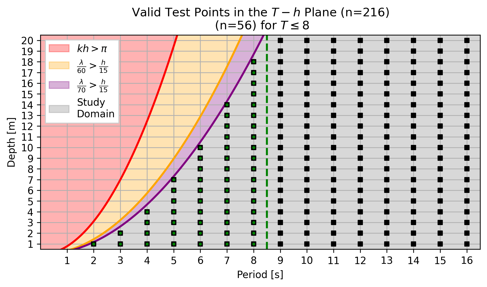

#  The Parameter Space
<!-- vscode-markdown-toc -->
* 1. [ Hydrodynamics and Wavemaker Specification](#HydrodynamicsandWavemakerSpecification)
* 2. [ Grid Specification](#GridSpecification)
* 3. [ Breakwater Geometry](#BreakwaterGeometry)
	* 3.1. [ Trapezoidal Breakwater](#TrapezoidalBreakwater)
	* 3.2. [ Grid Imprecision](#GridImprecision)
	* 3.3. [ Flat Tanks](#FlatTanks)
	* 3.4. [ Summary](#Summary)
* 4. [ Breakwater Properties](#BreakwaterProperties)
* 5. [ Setting up Regions of the Domain](#SettingupRegionsoftheDomain)
* 6. [ Timing](#Timing)
* 7. [ Summary](#Summary-1)
* 8. [ Selection of Parameters](#SelectionofParameters)
	* 8.1. [ Parameters Kept Constant](#ParametersKeptConstant)
	* 8.2. [ The Period-Depth Plane](#ThePeriod-DepthPlane)
	* 8.3. [ Geometry](#Geometry)

<!-- vscode-markdown-toc-config
	numbering=true
	autoSave=true
	/vscode-markdown-toc-config -->
<!-- /vscode-markdown-toc -->
##  1.  Hydrodynamics and Wavemaker Specification
All cases are run as one-dimensional models, using an internal wavemaker. Cases may be constructed as either _regular_ or _irregular_. 
- **Regular**: The standard regular wavemaker of FUNWAVE-TVD (`WAVEMAKER=WK_REG`), requiring `AMP_WK`, `Tperiod`, and `DEP_WK` for this model setup.
- **Irregular**: The standard irregular wavemaker of FUNWAVE-TVD (`WAVEMAKER=WK_IRR`) of FUNWAVE-TVD, which uses a TMA-spectrum. requiring `Hmo`, `FreqPeak`, etc.

Note that the expected input parameters for each wavemaker are different, so require some code to unify. For the amplitude, we define a nondimensional wave height `relH`

$$ \texttt{relH} = \frac{H_{mo}}{h}$$
where $h$ is a representative depth (taken simply as `DEP_WK` here) and $H_{mo}$ is the significant wave height. To convert into parameters FUNWAVE-TVD needs, the following are done: 

- `AMP_WK` = `relH`$\times$`DEP_WK`/2
- `Hmo` = `relH`$\times$`DEP_WK`

For the period/frequencies, `Tperiod` is used for either, with `FreqPeak` given as:

- `FreqPeak` = $1/$`FreqPeak`

Thus, either regular/irregular waves can be generated in this test suite under these assumptions and unified notation.

> [!IMPORTANT]
> **Parameters to Set**
>
> `WAVEMAKER`: Either `WK_REG` or `WK_IRR`
> 
> `relH`: The relative wave height used of the forced regular/irregular waves
>
> `Tperiod`: Period of the regular or irregular waves

Note that the `DEP_WK` variable is not explicitly set, with the pipeline automatically filling this out based on the location of the wavemaker.

##  2.  Grid Specification
The grid sizing for `DX` and `DY` follows previous USACE recommendations, using:

$$ \texttt{DX} = \texttt{DY} = \frac{\lambda_0}{70}$$

where $\lambda_0$ is calculated from the linear dispersion relation $\omega^2=gk_0\tanh{(k_0h_0)}$. 

##  3.  Breakwater Geometry

###  3.1.  Trapezoidal Breakwater
The breakwater geometry follows the lead of Marissa Torres and Levi Cass, who defined the dimensions of the breakwater based on standard nondimensional measures- the relative freeboard, side slopes, and top width.
 
The relative freeboard is given as: $$\texttt{relF}=\frac{z_{crest}}{H_{mo}}$$

where $z_{crest}$ is the $z$-coordinate of the the crest of the structure. Thus, for _submerged_ structures, $z_{crest}<0$ and thus `relF`$<0$. For _emergent_ structures, $z_{crest}>0$ and `relF`$>0$. The results of such a configuration are shown below:

The side slopes of the trapezoidal breakwater are given as the standard rise/run and already non-dimensional. The width of the top of the structure $w$ is non-dimensionalized as a function of `DX`, which itself is nondimensionalized on the wavelength $\lambda_0$. such that: $$w=\pi_4\lambda_0$$

###  3.2.  Grid Imprecision
Note that such a specification cannot be accurately realized on a discrete grid, since the points defining the trapezoid may not lie neatly on the grid. This is shown in the figure below:

Thie effect may be more pronounced in some cases, although it depends on the slopes, `DX` specification, and ultimately hydrodynamics. Thus, some care should be taken when identifying the verticies of the trapezoid in the actual FUNWAVE-TVD input. There is more disccusion of this in the pipeline section. 

###  3.3.  Flat Tanks
Another question of interest is how the hydrodynamics behave in the absence of any bathymetry modification, such that the bathymetry is essentially "flat", with the breakwater effect solely being applied via the addition of bottom friction or a breakwater absorption scheme. 

For direct comparison to the trapezoidal breakwater cases, the structure is first constructed and then "removed" to make sure the sizing of the affected regions match. See the figure below:

This is toggled on and off via the `FLAT_OR_TRAP` parameter. Note that even if `FLAT` is selected, the relevant widths it would have had are still stored.

###  3.4.  Summary
In summary, the following parameters define the breakwater geometry:
> [!IMPORTANT]
> **Parameters to Set**
>
> `relF`: Relative freeboard $z_{top}/H_{mo}$. Negative for submerged breakwaters, positive for emergent breakwaters
> 
> `PI_4`: The relative wave height used of the forced regular/irregular waves
>
> `m`: Side slopes of the trapezoidal breakwater
>
> `FLAT_OR_TRAP`: either `FLAT` or `TRAP`, indicating whether or not the trapezoidal structure calculated should actually be included.

##  4.  Breakwater Properties
A key objective of this study is to assess the relative impact of bottom friction `Cd` and FUNWAVE-TVD's `BreakwaterAbsorptionCoefficient` on the hydrodynamic behavior of the breakwater. To do this, the `FRICTION_FILE` or `BREAWKWATER_FILE` is used to setup both respectively. This is only done over the structure, as shown in the figure below:

Recall that bottom friction solely applies a quadratic drag friction using the _depth-averaged_ horizontal velocity $(u,v)$ and acts as a boundary term, whereas the breakwater setup acts on the _depth-integrated_ mass flux, and can thus be thought to act throughout the water column. Thus, in the diagram, friction is only shown on the bottom and BWAC throughout the column. 

The aim of this study is to directly compare similar values of bottom friction `Cd` and the `BreakWaterAbsorptionCoefficient`, so a unified notation is adopted. Each can be toggled on 

> [!IMPORTANT]
> **Parameters to Set**
>
> `USE_CDBWAC`: Either `CD` or `BWAC`
> 
> `CDBWAC`: The value of either `CD` or `BreakwaterAbsorptionCoefficient`, depending on if `USE_CDBWAC` option is used.

##  5.  Setting up Regions of the Domain
The relative position of the wavemaker and width of sponges on the west/east side of the domain are non-dimensionalized by the wavelength $\lambda_0$, as shown below:

Note that the entire tank width is nondimensionalized by wavelength with the exception of the region with the sloping faces, which are set by values of $m$ defining the slopes. The flat case maintains the same width as if the structure was there.

> [!IMPORTANT]
> **Parameters to Set**
>
> `PI_1`: Nondimensional width of the western sponge layer, in terms of $\lambda_0$
> 
> `PI_2`: Nondimensional width of the distance from the western sponge layer to the wavemaker position, in terms of $\lambda_0$
> 
> `PI_3`: Nondimensional width of the distance from the wavemaker to the western toe of the breakwater region, in terms of $\lambda_0$
> 
> `PI_4`: Nondimensional width of the crest of the breakwater region, in terms of $\lambda_0$
> 
> `PI_5`: Nondimensional width of the distance between the eastern toe of the breakwater region to the beginning of the eastern sponge, in terms of $\lambda_0$
>
> `PI_6`: Nondimensional width of the eastern sponge layer, in terms of $\lambda_0$

##  6.  Timing
Setting the `TOTAL_TIME` parameter is based on the period:
$$t_{prop} =  \tau_1 \times \texttt{Tperiod}$$

##  7.  Summary
Thus, a problem in this test suite is fully specified by setting the following parameters:

> [!IMPORTANT]
>
> **Domain Sizing Parameters**: `PI_1`, `PI_2`, `PI_3`, `PI_5`, `PI_6`
>
> **Hydrodynamic Parameters**: `Tperiod`, `DEP_WK`, `relH`, `WAVEMAKER`
>
> **Breakwater Geometry Parameters**: `relF`, `m_slope`, `PI_4`, `FLAT_OR_TRAP`
>
> **Breakwater Properties**: `USE_CDBWAC`, `CDBWAC`

##  8.  Selection of Parameters

###  8.1.  Parameters Kept Constant
For the purposes of this study, all of the $\pi$ parameters are kept constant, keeping the relative dimensions of the domain and the width of the crest of the structure constant. 

Additionally, the relative freeboard `relF` relative wave height `relH` are kept constant.

Also, a single slope of `m_slope` is considered in this study.

These are the values used:

| **Parameter** | Value | | **Parameter** | Value
|-------|-------|--|-- | --|
| `PI_1` | 2 | | `relF`| 0.1 |
| `PI_2` | 2 | | `relH`| 0.1 |
| `PI_3` | 2 | || |
| `PI_4` | 2 | | `m_slope` | 3 |
| `PI_5` | 2 | | |
| `PI_6` | 2 | | |

###  8.2.  The Period-Depth Plane
For those problem, we further restrict our position in the `Tperiod`-`DEP_WK` plane to cases where the hydrodynamic condition of $kh>\pi$ and `DX`>$h/15$ can simultaneously be true, resulting in the following possible pairs for integer values of $T-h$

To further restrict the domain, only $T\leq 8$ are used, resulting in 56 possible values. 

###  8.3.  Geometry
Both possibilities of geometry are considered

| **Parameter** | Possible Values |
|-------|-------|
| `FLAT_OR_TRAP` | `FLAT`, `TRAP` |